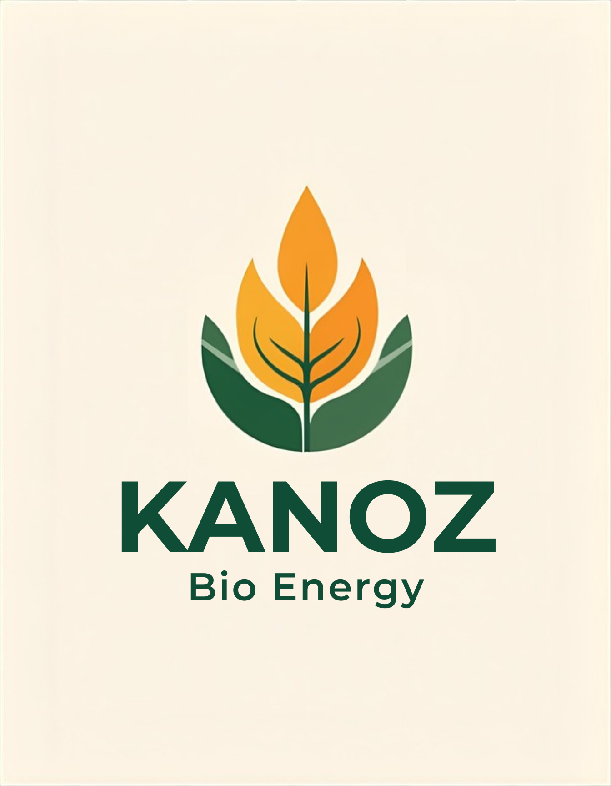

<p align="center">
  
</p>

<h1 align="center">Kanoz Bio Energy</h1>

<p align="center">
  <strong>Powering Industry with Clean Biomass Energy</strong>
</p>

<p align="center">
  <a href="https://kanoz.in">🌐 Website</a> ·
  <a href="https://wa.me/919839788886">💬 WhatsApp</a>
</p>

---

## About

Kanoz Bio Energy is a leading manufacturer of **premium biomass pellets** for sustainable energy across India. We convert agricultural waste into clean, high-performance fuel — helping industries reduce carbon footprints while cutting energy costs.

## Product Specifications

| Parameter       | Value            |
|-----------------|------------------|
| GCV             | 3400+ Kcal/kg    |
| Moisture        | < 8%             |
| Ash Content     | < 5%             |
| Pellet Size     | 8mm              |
| Emissions       | Low              |
| Availability    | Bulk supply, pan-India |

## Website

This repository contains the source code for [kanoz.in](https://kanoz.in) — a single-page responsive marketing website.

### Tech Stack

- **HTML5** — semantic, accessible markup
- **CSS3** — custom properties, flexbox/grid, responsive design
- **Vanilla JavaScript** — form validation, scroll interactions, mobile menu
- **Fonts** — Inter + Playfair Display (Google Fonts)

### Key Features

- Fully responsive (mobile-first design)
- WCAG 2.1 AA accessible (ARIA labels, focus management, screen reader support)
- SEO optimized (Open Graph, Twitter Cards, JSON-LD structured data)
- WhatsApp CTA integration
- Contact form with client-side validation
- Smooth scroll navigation with active section highlighting
- iOS safe-area support for notched devices
- Prefers-reduced-motion support

### Sections

| Section          | Description                                      |
|------------------|--------------------------------------------------|
| Hero             | Main headline with call-to-action buttons        |
| About            | Company mission and background                   |
| Products         | Pellet specifications and features               |
| Process          | Manufacturing journey — field to fuel             |
| Why Us           | Key differentiators (24/7 production, ISO, etc.) |
| Testimonials     | Customer reviews with aggregate rating           |
| Sustainability   | Environmental impact messaging                   |
| Contact          | Inquiry form with WhatsApp integration           |

## Getting Started

No build step required — it's a static site.

```bash
# Clone the repo
git clone https://github.com/raaghavk/kanoz-website.git
cd kanoz-website

# Open in browser
open index.html
# or use a local server
python3 -m http.server 8000
```

## Project Structure

```
kanoz-website/
├── .github/
│   └── workflows/
│       └── deploy.yml      # GitHub Actions CI/CD pipeline
├── index.html              # Complete website (HTML + CSS + JS)
├── portal.html             # Customer portal (coming soon page)
├── manifest.json           # PWA manifest
├── sw.js                   # Service worker for offline support
├── logo.png                # Company logo
├── .gitignore
└── README.md
```

## Feature Roadmap

All planned features have been implemented:

### High Priority

- [x] **Dark Mode** — Toggle between light and dark themes; respects `prefers-color-scheme`
- [x] **Backend Form Handling** — Connected to Formspree for real form submissions
- [x] **Analytics** — Plausible analytics integration (privacy-friendly, no cookies)

### Medium Priority

- [x] **Blog / Resources Section** — Articles on biomass energy, case studies, and industry insights
- [x] **Multi-language Support (i18n)** — English + Hindi language switcher with stored preference
- [x] **Pricing Calculator** — Interactive savings calculator (coal vs pellet cost comparison)
- [x] **Customer Portal** — Coming soon page with feature preview and launch notification signup

### Nice to Have

- [x] **PWA Support** — Service worker + manifest for offline access and "Add to Home Screen"
- [x] **Animated Infographics** — Counter animations on sustainability impact cards
- [x] **Live Chat Widget** — Tawk.to integration for real-time visitor support
- [x] **Testimonials Carousel** — Auto-rotating carousel with 5 testimonials, dots, and navigation
- [x] **CI/CD Pipeline** — GitHub Actions workflow to auto-deploy to GitHub Pages
- [x] **Cookie Consent Banner** — GDPR/IT Act compliant banner with accept/decline

## License

All rights reserved. &copy; Kanoz Bio Energy.

---

<p align="center">
  Made with 🌿 for a cleaner planet
</p>
test
